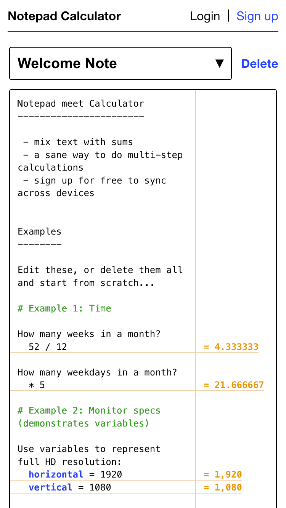

# Notepad Calculator

Mix free form text notes with calculations. This is a NodeJS responsive web-app with user accounts, allowing you to create and access your notes from any mobile or desktop browser.

Use it at [notepadcalculator.com](https://notepadcalculator.com).



This was originally inspired by Soulver, an app for iOS and mac that I hadn't even used myself, but I liked the concept.

## How to run locally

Prerequisite: Docker 27

```sh
docker compose up
```

The site will now be running on your local machine at http://localhost:4002

## More info

If you want to run it yourself without Docker, either locally or in production, they you are welcome to try but I can't offer you any support. That said, you can read my own notes in [advancedReadme.md](docs/advancedReadme.md).
